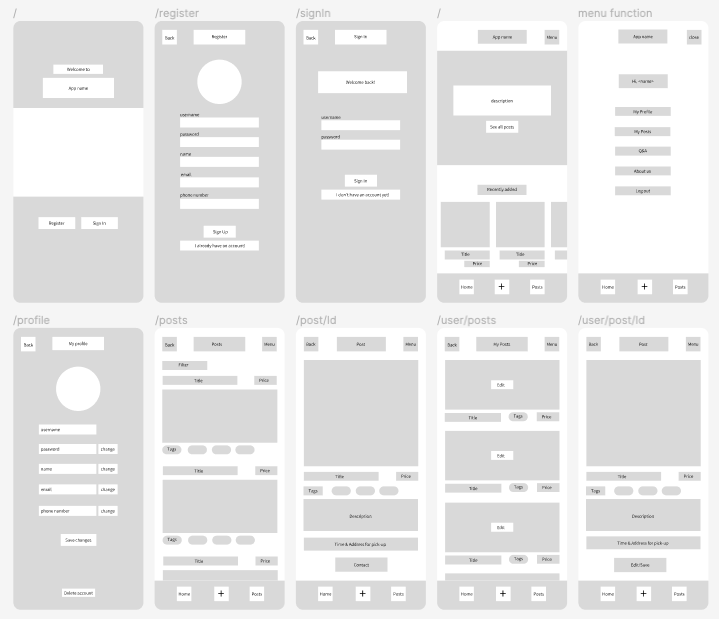

# FoodShare

### What is FoodShare?

The concept of this application is a mobile first platform where users are able to post their leftover, homecooked meals to prevent food from being wasted. Every user has the option to post and/or buy a meal. Up to four images can be uploaded when creating or editing a post and the posts can be filtered based on the users preferences.

Click here to see the <a href="https://foodshare.fly.dev/">deployed version</a>.  
For the optimal experience, please set the window to a mobile screen size (like iPhone 12 Pro).

### Ideas & Planning

### Layout & Designing

### Figma Prototype

### Database Schema

### Setup instructions

- Clone the repository with git clone <repo>
- Setup the database by downloading and installing PostgreSQL
- Create a user and a database
- Create a new file .env
- Copy the environment variables from .env-example into .env
  Replace the placeholders xxxxx with your username, password and name of database
- Sign up to cloudinary and paste the account name in the .env and next.config.js file
- Install dotenv-cli with `yarn add dotenv-cli`
- Run `yarn install` in your command line
- Run the migrations with `yarn migrate up`
- Start the server by running `yarn dev`
- Open <a href="http://localhost:3000">localhost</a> with your browser to see the result

### Deploy on Fly.io

- Generate a Fly.io Token, called GitHub Actions Deploy Token and copy the token
- Create a new repository secret in the GitHub repo, named FLY_API_TOKEN
- Log into Fly.io on the command line with `flyctl auth login`
- Create an app flyctl apps create --name <app name>
- Create the Fly.io config files
  Add database credentials using Fly.io secrets flyctl secrets set PGHOST=localhost PGDATABASE=$(openssl rand -hex 16) PGUSERNAME=upleveled$(openssl rand -hex 16) PGPASSWORD=$(openssl rand -base64 32)
- Add built time environment variables to the config files (fly.toml, Dockerfile) as described on <a href="https://fly.io/docs/languages-and-frameworks/nextjs/#what-about-build-time-environment-variables">Fly.io</a>
- Create a 1GB volume for the PostgreSQL database in Frankfurt flyctl volumes create postgres --size 1 --region fra
- Run `flyctl deploy`in your command line to deploy
